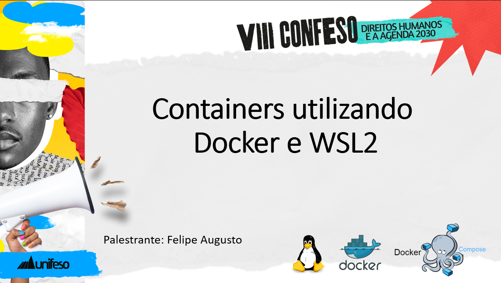

# Workshop UNIFESO
# Estratégia de containers utilizando Docker e WSL2



Agradeço a oportunidade de poder apresentar uma pequena parte do que se pode fazer utilizando estratégia de containers com docker e wsl2.

Abaixo uma lista de comandos que foram executados durante a apresentação, realizada online, no dia 04/10/2023 as 20:00.

# Comandos

### Lista de containers criados

Para executar:
## - SonarQube 
> Por meio de criação de container Docker, execute o comando
````docker container run --rm -d --name sonar-canal-deploy -p 9044:9000 sonarqube:9.9.2-community````
e depois abra seu navegador na url ````https://localhost:9044````
> > informar o user|senha=admin
````
docker container run --rm -d --name sonar-canal-deploy \
-p 9044:9000 \
sonarqube:9.9.2-community
````
## - RabbitMQ
> Por meio de criação de container Docker, execute o comando
e depois abra seu navegador na url ````http://localhost:15672````
> > > informar o usuario=user e password=deploy
````
docker run --rm -d \
--hostname my-rabbit \
--name deploy-rabbit \
-p 15672:15672 \
-e RABBITMQ_DEFAULT_USER=user \
-e RABBITMQ_DEFAULT_PASS=deploy \
rabbitmq:3.12.6-management
````
## - Postgres 
> Por meio de criação de container Docker, execute o comando
e precisaremos de uma IDE para conectar no serviço do banco de dados.
> Veja o proximo item criado.
````
docker run --rm -d --name postgresql \
-e POSTGRES_USER=user \
-e POSTGRES_PASSWORD=deploy \
postgres:16.0

````
## - pgAdmin
> Por meio de criação de container Docker, execute o comando
e depois abra seu navegador na url ````https://localhost:9047```` ou ````http://localhost:9046````
> informar o email user@deploy.com e senha deploy
````
docker run --rm --name deploy-pgAdminhn \
-p 9046:80 \
-p 9047:443 \
-e PGADMIN_DEFAULT_EMAIL=user@deploy.com \
-e PGADMIN_DEFAULT_PASSWORD=deploy \
-e PGADMIN_DISABLE_POSTFIX="true"\
 dpage/pgadmin4:7.7
````
** Confirme que todos os containers acima não estão sendo executados para conseguir executar o comando abaixo:


Executar o comando ````docker-compose -f docker-compose-unifeso.yml up -d```` desde que dentro do terminal bash (tipo wsl2 ou linux) e com o serviço ````dockerd```` rodando.

## Outros containers
### Redis

````docker run --name redis-server-deploy -p 6379:6379 redis````

````docker exec -it redis-server-deploy redis-cli````

### Azure SQL EDGE
````docker run --cap-add SYS_PTRACE -e 'ACCEPT_EULA=1' -e 'MSSQL_SA_PASSWORD=Abcd1234%' -e 'MSSQL_PID=Developer' -p 1433:1433 --name azuresqledge -d mcr.microsoft.com/azure-sql-edge:2.0.0````

## Outros comandos utilizados

````wsl --list --online | -l -o````

````sudo apt install docker.io````

````sudo apt install docker-compose````

````docker container run hello-world````

````docker container ls````

````docker container ls -a````

````docker container rm <CONTAINER ID>````

````docker image ls````

````docker image rm <IMAGE ID>````

````docker network ````

````docker volume ````

````docker container inspect <container_id>````

````docker container logs <container_id>````

````docker image history <namespace/project_name:tag>```` 

### Para  ambiente local

````docker container rm -f $(docker ps -a -q)````

````docker volume rm $(docker volume ls -q)````

````docker image rm -f $(docker image ls -a -q)````

````docker system prune````

:white_check_mark:
